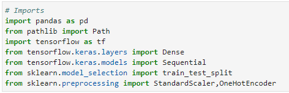

# fintech_challenge_13
This challenge incorperates a csv file with over 34,000 organizations with a variety of information about each business including whether or not it became successful.
We will use this data to create a binary classifier model that will predict whether or not an applicant will become a successful business. We we also attempt to optomize the
model twice within this notebook.

---
## Technologies
This program utilizes Jupyter Lab with the following libraries:

---

## Summary
First, the program reads the csv file found in the Resources folder into a DataFrame. Next, we prepare the DataFrame for the model. We utilize OneHotEncoder to transform our
catagorical data into numerical. Then we use StandardScaler to scale our data. Next, thr original model is then created using the parameters provided by the assignment. 
Then, we create two more models in an attempt to optomize our model. Finally, we save our models as HDF5 files in the Resources folder.
---
## Contributors
Kevin Gross

---
## License
This program is covered under the MIT license.